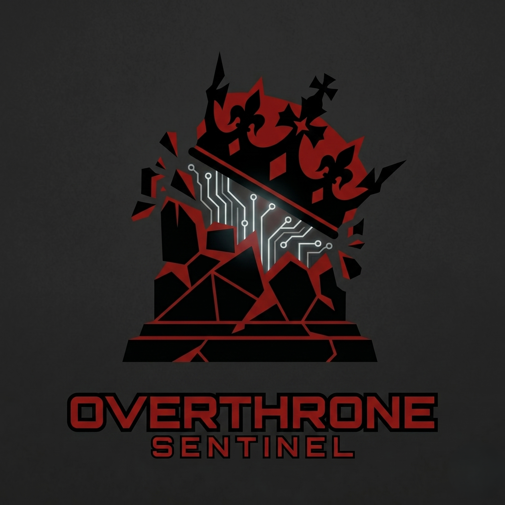

<div align="center">
   
</div>

<h1 align="center">OVT-Sentinel</h1>

<p align="center">
   
   
   
   
   
</p>

<p align="center">AI-powered Discord bot for Overthrone (OVT) Active Directory testing. Invite the bot, run an agent on your Kali VM, and control everything from Discord.</p>

<p align="center">
   <a href="#get-started">Get Started</a>
   · <a href="#discord-commands">Commands</a>
   · <a href="#architecture">Architecture</a>
   · <a href="#what-it-does">Features</a>
   · <a href="#faq">FAQ</a>
</p>

## Get Started

### 1. Invite the Bot to Your Server

Click this link → pick your server → done:

```
https://discord.com/api/oauth2/authorize?client_id=1509111346824740964&permissions=1099858774022&scope=bot
```

No hosting, no config, no Discord Developer account needed.

### 2. Install the Agent on Your VM

Open a terminal on your Kali/attack VM and run:

```bash
curl -sSf https://sh.rustup.rs | sh -s -- -y
source "$HOME/.cargo/env"
git clone https://github.com/Karmanya03/OVT-Sentinel
cd OVT-Sentinel/sentinel-agent
cargo build --release
```

### 3. Generate Token & Get Your Command

In any channel the bot can see, type `/agent register` and pick a mode:

```
/agent register mode:reverse label:Kali-VM      # Agent → Bot (recommended, no tunnel needed)
/agent register mode:tunnel label:Kali-VM       # Cloudflare tunnel (requires outbound internet)
/agent register mode:direct label:Kali-VM       # Raw WS (Kali needs public IP)
```

| Field | What it does |
|-------|-------------|
| `mode` | `reverse` (agent connects to bot), `tunnel` (cloudflared), `direct` (raw WS) |
| `label` | Friendly name for your VM (optional) |

**Recommended: Reverse mode** — the agent connects **outbound** to the bot via WSS (port 443). No tunnel binary, no open ports, no DNS trickery. Works wherever Kali has HTTP/S outbound.

The bot replies with your token and the exact command to run:

```
📝 Agent Token Generated

No tunnel needed — agent connects outbound to the bot.

Run on Kali:
sudo ./sentinel-agent --token "f439a7b3..." \
  --connect-to-bot "wss://app.koyeb.app/agent-ws"

Token: f439a7b3...
Keep this secret!
```

### 4. Run the Agent on Kali

**Reverse mode (recommended):**
```bash
sudo ./target/release/sentinel-agent --token "f439a7b3..." \
  --connect-to-bot "wss://app.koyeb.app/agent-ws"
```

**Reverse with Cloudflare fallback (if reverse connect fails):**
```bash
sudo ./target/release/sentinel-agent --token "f439a7b3..." \
  --connect-to-bot "wss://app.koyeb.app/agent-ws" \
  --fallback-tunnel \
  --bot-register-url "https://app.koyeb.app/register"
```

This tries reverse first; if the bot is unreachable, it falls back to cloudflared tunnel automatically.

**Cloudflare tunnel mode only:**
```bash
# Install cloudflared (one-time)
sudo curl -sSL https://github.com/cloudflare/cloudflared/releases/latest/download/cloudflared-linux-amd64 -o /usr/local/bin/cloudflared
sudo chmod +x /usr/local/bin/cloudflared

# Start the agent
./target/release/sentinel-agent --token "f439a7b3..." --tunnel
```

The agent prints confirmation:
```
🔗 Connecting to bot: wss://app.koyeb.app/agent-ws
```

### 5. Agent Auto-Connects

With `--connect-to-bot`, the agent connects automatically. **No `/agent connect` needed.** The bot receives the connection, validates your token, and makes the agent available immediately.

### 6. Start Chatting

```
/chat enumerate the domain
/run enum-all
/screenshot
```

Everything runs on **your** VM. You're done.

---

### Alternative: Direct Connection (no tunnel)

If Kali has a public IP:

1. `/agent register mode:direct label:Kali-VM`
2. On Kali: `./target/release/sentinel-agent --token "..." --bind 0.0.0.0:7331`
3. `/agent connect ws_url:ws://YOUR_PUBLIC_IP:7331`

### Alternative: WireGuard Mesh

For air-gapped Kali that connects via WireGuard to a relay VPS:

1. Set up WireGuard between Kali and a relay VPS
2. On the relay VPS, forward port 7331 to Kali's WireGuard IP:  
   `iptables -t nat -A PREROUTING -p tcp --dport 7331 -j DNAT --to-destination 10.0.0.2:7331`
3. `/agent register mode:direct label:Kali-VM`
4. On Kali: `./target/release/sentinel-agent --token "..." --wireguard /etc/wireguard/ad_lab.conf`
5. `/agent connect ws_url:ws://RELAY_VPS_IP:7331`

### Kali Network Tip: Dual NIC Setup

For AD lab testing, give Kali **two** network adapters:

| Adapter | Mode | Subnet | Purpose |
|---------|------|--------|---------|
| `eth0` | NAT | `10.0.2.x` (DHCP) | Internet access (tool downloads, bot connection) |
| `eth2` | Host-only | `192.168.56.x` (static) | AD lab target network |

Use the included `switch-network.sh` to toggle between modes:

```bash
sudo ./switch-network.sh both   # NAT + lab simultaneously (recommended)
sudo ./switch-network.sh nat    # Internet only (download tools)
sudo ./switch-network.sh lab    # Lab only (full isolation)
```

In `both` mode, eth0 is the default route (internet) and eth2 has `never-default=yes` so lab traffic stays isolated. The agent uses eth0 to reach the bot via `--connect-to-bot`.

---

## Discord Commands

| Category | Command | Description |
|----------|---------|-------------|
| **Agent** | `/agent register [mode]` | Generate token & get agent command (mode: reverse/tunnel/direct) |
| | `/agent connect <ws_url>` | Connect your attack VM to the bot (tunnel/direct mode) |
| | `/agent disconnect` | Remove your VM from the bot |
| | `/agent status` | Check your agent connection status |
| | `/agent list` | Show your registered agents |
| **Info** | `/info` | Bot info, version & credits |
| | `/help [category]` | Detailed command reference |
| **Session** | `/session-start` | Start a session in a dedicated thread |
| | `/session-end` | End session & archive thread |
| | `/resume` | Resume session in current thread |
| | `/chat <message>` | Chat with the AI — agentically runs OVT/bash commands on your VM |
| | `/set <dc> <domain> <user> <pass>` | Set session targets (ephemeral) |
| | `/session` | Show session summary |
| **Attack** | `/run <command>` | Run any OVT command |
| | `/stream <command>` | Live streaming output |
| | `/doctor` | Run `ovt doctor` health check |
| | `/kill <id>` | Kill a running command |
| | `/enum-all` | Full AD enumeration |
| | `/kerberoast` | Kerberoasting |
| | `/spray <password>` | Password spray with lockout check |
| | `/adcs-scan` | ADCS vulnerability scan |
| | `/dump` | DCSync credential extraction |
| | `/crack <hashfile>` | Crack hashes from loot |
| **Monitor** | `/status` | VM CPU/RAM/disk/network status |
| | `/loot` | Browse loot files (paginated) |
| | `/readloot <path>` | Read a loot file |
| | `/screenshot [analyze]` | Screenshot with optional AI vision |
| | `/browse <url>` | Open URL in VM browser |
| **AI** | `/ask <question>` | Ask the AI anything — it can run OVT + bash commands on your VM |
| | `/analyze <cmd> <output>` | Paste OVT output for AI review |
| | `/suggest` | AI suggests the next best move |
| | `/mistakes` | AI critiques your session |
| | `/path <source> <target>` | Attack path analysis |
| | `/bloodhound <file>` | BloodHound JSON analysis |
| **Utilities** | `/search <query>` | Web search for vulns/exploits |
| | `/cve <product>` | CVE lookup for Windows Server |
| | `/log` | Recent Sentinel events |
| | `/history` | Session command history |

## Architecture

```text
                    ┌─────────────────────────────────────┐
                    │          Discord Cloud               │
                    │  (slash commands, ephemeral replies) │
                    └──────────┬──────────────────────────┘
                               │ HTTPS/WSS
                               ▼
                    ┌─────────────────────────────────────┐
                    │         sentinel-bot                 │
                    │  ┌───────────────────────────────┐   │
                    │  │  Discord Gateway (discord.py)   │   │
                    │  │  - Command routing             │   │
                    │  │  - Embed builders              │   │
                    │  │  - Button/modals               │   │
                    │  └──────────────┬────────────────┘   │
                    │                 │                     │
                    │  ┌──────────────▼────────────────┐   │
                    │  │  Core Services                 │   │
                    │  │  - LLMBrain (multi-provider)   │   │
                    │  │  - AgentManager (per-user)     │   │
                    │  │  - SessionMemory (DB layer)    │   │
                    │  │  - RateLimiter                 │   │
                    │  │  - Tools (web, search, etc)    │   │
                    │  └──────────────┬────────────────┘   │
                    │                 │                     │
                    │  ┌──────────────▼────────────────┐   │
                    │  │  Combined Server (port 8000)    │   │
                    │  │  - GET /, /health (healthcheck) │   │
                    │  │  - GET /register (tunnel auth)  │   │
                    │  │  - WS /agent-ws (agent connect) │   │
                    │  └──────────────────────────────────┘   │
                    │                                      │
                    │  Hosted on: Koyeb (free tier)        │
                    │  Database: PostgreSQL (session/chat) │
                    └──────────┬──────────────────────────┘
                               │
                    ┌───────────┼───────────┐
                    │           │           │  ← Agent connects OUTBOUND
               WebSocket   WebSocket   WebSocket        (reverse mode)
               (wss://)    (wss://)    (wss://)
                    ▲           ▲           ▲
                    │           │           │
                    │   ┌───────┼───────┐   │
           ┌────────┘   │       │       │   └────────┐
           │ Agent A    │  Agent B  │    Agent C    │
           │ (User 1)   │  (User 2) │   (User 3)    │
           │ Kali VM    │  Kali VM  │   Kali VM     │
           └────────────┘  └────────┘   └────────────┘

           Each agent runs sentinel-agent (Rust):
           ┌──────────────────────────────────────┐
           │  sentinel-agent                      │
           │  ┌────────────────┐  ┌─────────────┐ │
           │  │ Connect to Bot │  │ WS Server   │ │
           │  │ --connect-to-  │  │ (port 7331, │ │
           │  │ bot (reverse)  │  │  tunnel)    │ │
           │  ├────────────────┤  ├─────────────┤ │
           │  │ Fallback       │  │ Executor    │ │
           │  │ --fallback-    │  │ (OVT cmds)  │ │
           │  │ tunnel (opt.)  │  └─────────────┘ │
           │  ├────────────────┤  ┌─────────────┐ │
           │  │ Monitor        │  │ Loot        │ │
           │  │ (sysinfo)      │  │ Watcher     │ │
           │  ├────────────────┤  ├─────────────┤ │
           │  │ Browser        │  │ WireGuard   │ │
           │  │ (scrn/browse)  │  │ (optional)  │ │
           │  └────────────────┘  └─────────────┘ │
           └──────────────────────────────────────┘
```

## What It Does

- **One bot, shared by everyone** — invite once, no app creation per user
- **Per-user agent** — each user registers their own Kali VM via `/agent register` + `/agent connect`
- **OVT command execution** — run Overthrone attacks from Discord
- **Live streaming** — see command output in real-time
- **Thread-based sessions** — dedicated workspace per session
- **AI chat + analysis** — multi-provider LLM with agentic tool calling (runs OVT + arbitrary bash commands on your VM)
- **VM monitoring** — CPU, RAM, disk, processes from Discord
- **Loot management** — browse, read, and analyze collected files
- **Screenshots + browser** — see what's on the VM screen

### Connectivity Modes

| Mode | Flag | Service | Ports | Best for |
|------|------|---------|-------|----------|
| **Reverse Connect** ⭐ | `--connect-to-bot` | Agent → Bot WS | TCP 443 (WSS) outbound only | **Kali behind NAT/firewall**, no tunnel needed |
| **Reverse + Fallback** | `--connect-to-bot --fallback-tunnel` | Reverse first, cloudflared if fails | TCP 443 outbound only | Unreliable internet, best of both |
| **Cloudflare Tunnel** | `--tunnel` | `cloudflared` → `trycloudflare.com` | TCP 443 outbound only | Kali with full internet (no DNS blocks) |
| **Direct** | None | Kali WS server | TCP 7331 (inbound) | Kali on same network as bot |
| **WireGuard** | `--wireguard` | `wg-quick` | Configurable/VPN | Air-gapped labs with relay VPS |

**Recommended: Reverse Connect** — the agent connects **outbound** to the bot's WebSocket server at `wss://<app>.koyeb.app/agent-ws` (port 443). No tunnel binary, no configuration, no open inbound ports. Works any time Kali can reach the bot's server via HTTPS. The bot authenticates the agent using the token generated by `/agent register`. Optionally pair with `--fallback-tunnel` for automatic cloudflared fallback.

## LLM Providers (Free & Paid)

| Provider | API Key Env Var | Default Model | Use For | Free Tier / Limits |
|----------|----------------|---------------|---------|-------------------|
| **NVIDIA NIM (Text)** ⭐ | `NVIDIA_API_KEY` | `google/gemma-4-31b-it` | Text generation (primary) | Dense 31B, fast, agentic/coding/reasoning, free trial |
| **NVIDIA NIM (Vision)** ⭐ | `NVIDIA_API_KEY` | `moonshotai/kimi-k2.6` | Vision / Image analysis | 1T MoE (32B active), multimodal (text+images+video) |
| **Cerebras** | `CEREBRAS_API_KEY` | `gpt-oss-120b` | Text fallback | Free, rate-limited |
| **Groq** | `GROQ_API_KEY` | `meta-llama/llama-4-scout-17b-16e-instruct` | Text + Vision fallback | 30 req/min, supports images |
| **MiniMax** (via NVIDIA) | `NVIDIA_API_KEY` | `minimaxai/minimax-m2.7` | Text fallback | Same key as NVIDIA, auto-chained |
| **OpenAI** | `OPENAI_API_KEY` | `gpt-4o-mini` | Text fallback | Paid |
| **SambaNova** | `SAMBANOVA_API_KEY` | `Meta-Llama-3.1-70B-Instruct` | Text fallback | Free, rate-limited |
| **Ollama** (local) | — | `llama3.1:70b` | Text fallback | Free, local |

**Priority chain for text:** NVIDIA (nemotron-3-ultra) → Cerebras → Groq → MiniMax → OpenAI → SambaNova → Ollama
**Priority chain for images:** NVIDIA (kimi-k2.6) → Groq → others

Multiple providers auto-chain as fallback. No need to set `LLM_PROVIDER` — just add API keys. NVIDIA handles both text and vision.

**NVIDIA NIM details**: Sign up free at [build.nvidia.com](https://build.nvidia.com) (no credit card). Get an `nvapi-...` key. This single key unlocks multiple models: **Nemotron-3-Ultra 550B** (text), **Kimi K2.6 1T** (vision), and **MiniMax M2.7** — all chain automatically. 100+ models available. **Only limit is ~40 requests/minute** — no token/credit caps. Can request 200 RPM upgrade. OpenAI-compatible API.

### Quick Koyeb Env Example

```text
DISCORD_TOKEN=...
DATABASE_URL=...
SERVER_PORT=8000
BOT_PUBLIC_URL=https://your-app.koyeb.app
SENTINEL_TOKEN=...
NVIDIA_API_KEY=nvapi-...
NVIDIA_MODEL=nvidia/nemotron-3-ultra-550b-a55b
NVIDIA_VISION_MODEL=moonshotai/kimi-k2.6
CEREBRAS_API_KEY=csk_...
```

No `LLM_PROVIDER` needed — fallback chain handles it.

The bot exposes a single port:
- **8000** — combined HTTP + WebSocket server (healthcheck GET /,/health, tunnel registration GET /register, agent WebSocket at /agent-ws)

Agent connects to: `wss://your-app.koyeb.app/agent-ws` (no port, uses default 443)

## Security

- **Token-authenticated WebSocket** — HMAC-signed auth between bot and agent
- **TLS (reverse mode)** — `--connect-to-bot` uses `wss://` (WSS over TLS), encrypted from agent to Koyeb edge
- **TLS (tunnel mode)** — `wss://` tunnels encrypted end-to-end through Cloudflare's edge
- **Ephemeral commands** — only you see your agent interactions
- **Destructive confirmation** — destructive commands need a button click
- **No shell injection** — process spawning uses argument arrays, not shell strings
- **Rate limiter** — 10 req/sec per user default
- **AI vision** — screenshot analysis via Groq Llama 4 Scout or Gemini 2.5 Flash
- **Auto-tunnel with `--tunnel`** — Cloudflare Quick Tunnel (no open inbound ports, outbound-only to Cloudflare on port 443)
- **Auto-fallback** — `--fallback-tunnel` tries reverse connect first, falls back to cloudflared if unreachable

## Testing

```bash
cd sentinel-bot
pip install -r requirements.txt
python -m pytest tests/ -v
```

```bash
cd sentinel-agent
cargo test
```

## FAQ

**Q: Do I need to host the bot?**
A: No. Someone already hosts it. Just invite it to your server and connect your VM with `/agent connect`.

**Q: Do I need a Discord Developer account?**
A: No. The bot is already created. You just need the invite link.

**Q: Do I need paid LLMs?**
A: No. Free tiers work fine (Gemini, Groq, SambaNova, Cerebras).

**Q: Is this a bot, an agent, or a tiny gremlin?**
A: Yes. The bot handles Discord, the agent lives on your VM, and the gremlin is the thing that renames your log files when you're not looking.

**Q: Will this run random shell commands and fry my box?**
A: No randomness. Commands are spawned with safe arg arrays. Destructive operations need your explicit confirmation.

**Q: Is this legal?**
A: This tool is for authorized testing only. Use responsibly.

**Q: How do I contribute?**
A: Fork, make a PR, add tests, and write clever commit messages. Bonus points for ASCII art and unit tests that include bad puns.

**Q: Any tips for keeping my VM alive?**
A: Don't run multiple `/enum-all` commands in a row. Give your VM water, CPU breaks, and dignity.
